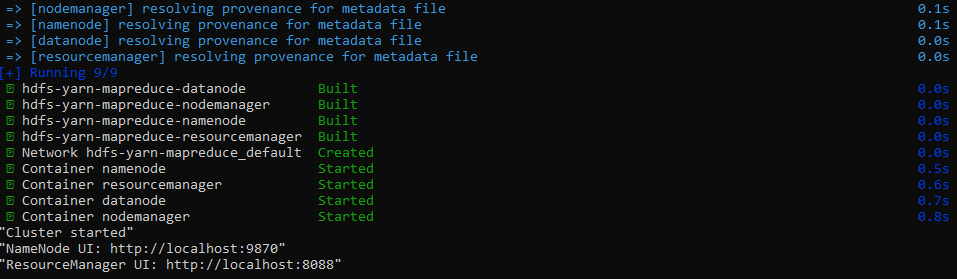
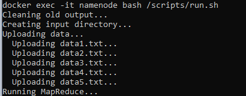
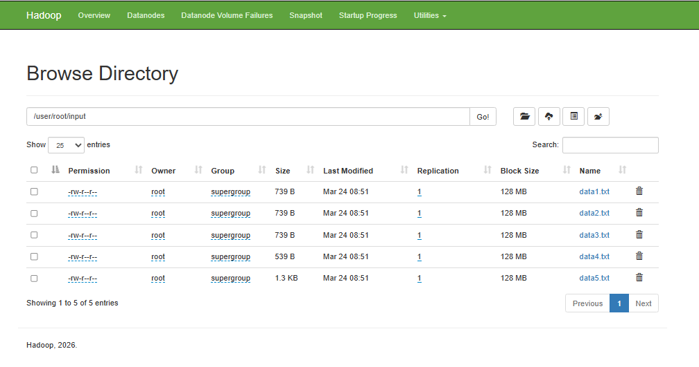
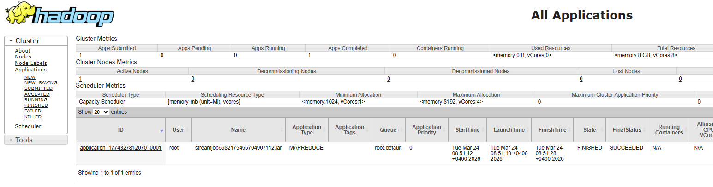
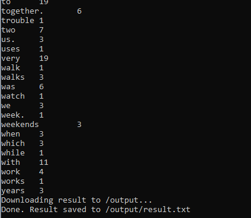

# Hadoop MapReduce на Docker

Кластер Hadoop (HDFS, YARN, MapReduce) в Docker с поддержкой Python.

## Запуск

`make up`      - запустить кластер  
`make run`     - выполнить задачу  
`make down`    - остановить кластер  
`make logs`    - показать логи  
`make shell`	 - войти в контейнер NameNode  
`make clean`	 - остановить кластер и удалить контейнеры

## Использование

1. Положите текстовые файлы в папку `input/`. Все файлы с расширением `.txt` будут обработаны.
2. Запустите кластер: `make up`
3. Запустите обработку: `make run`
4. Результат выводится в консоль и сохраняется в `output/result.txt`
5. Остановите кластер: `make down`

## UI

NameNode: http://localhost:9870  
ResourceManager: http://localhost:8088

## Пример использования

### Запуск кластера

### Запуск задачи MapReduce

### Файловая система HDFS

### Задача в YARN

### Результат выполнения

